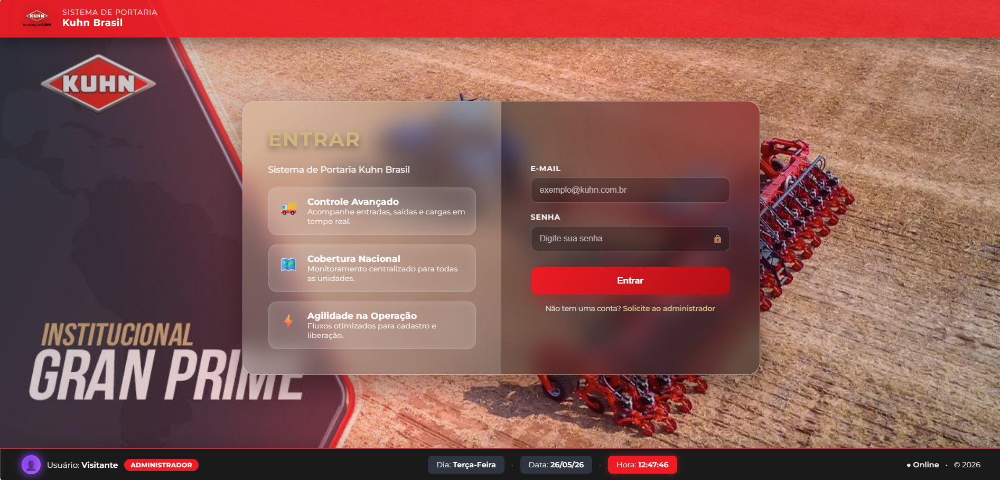
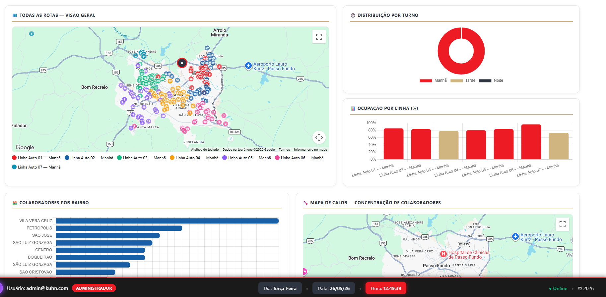
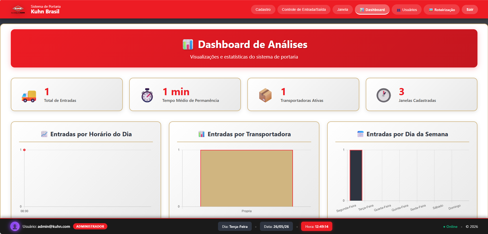
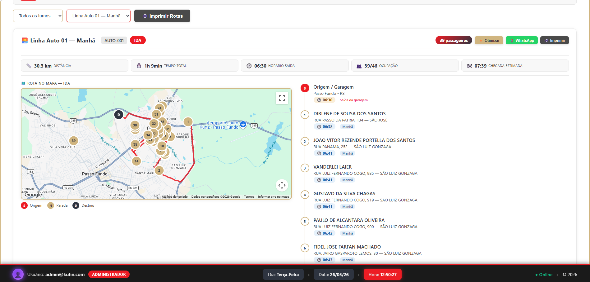
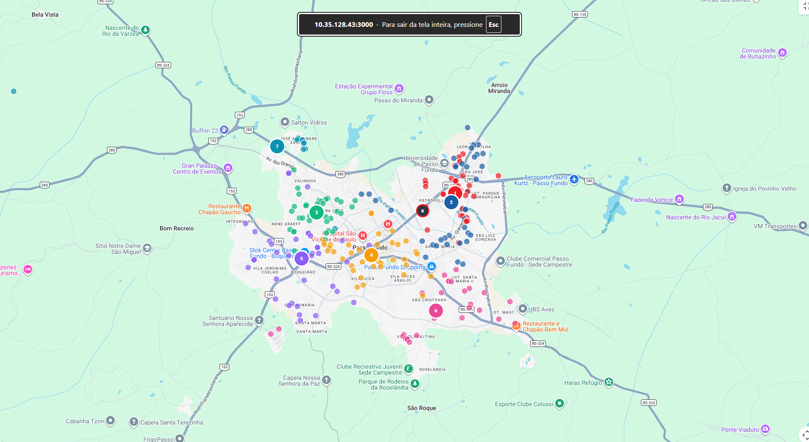
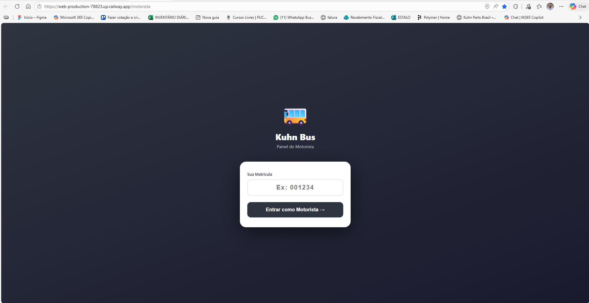
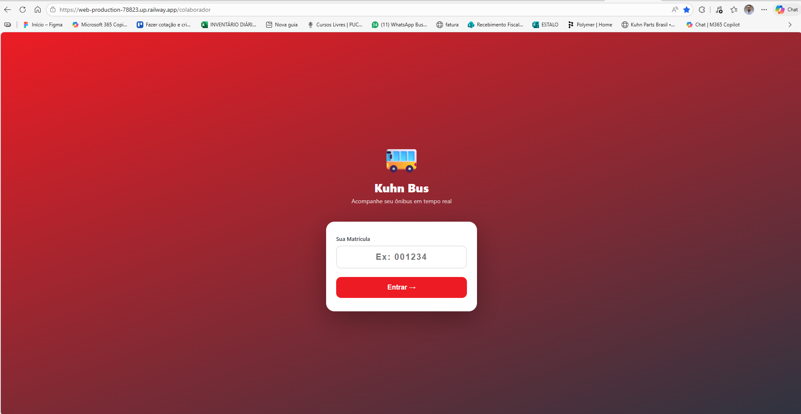

# 🚀 Plataforma Logística Inteligente — Transporte Corporativo em Tempo Real

Plataforma completa para gestão logística corporativa, integrando controle de portaria, roteirização inteligente e rastreamento em tempo real de colaboradores.

---

## 🧠 Visão Geral

Este projeto foi desenvolvido para centralizar e otimizar toda a operação logística de transporte corporativo, conectando planejamento, execução e monitoramento em tempo real.

A solução une múltiplos módulos integrados:

- 🛂 Portaria logística
- 🚚 Roteirização inteligente
- 🚍 Gestão de frota
- 📡 Rastreamento em tempo real
- 📊 Dashboard analítico
- 📱 Aplicações para motorista e colaborador

---

## 🧩 Arquitetura do Sistema

A plataforma é composta por três grandes módulos:

### 🛂 Portaria
- Controle de entrada e saída
- Cadastro de motoristas e veículos
- Monitoramento de tempo de permanência

---

### 🚚 Roteirização
- Agrupamento automático de colaboradores
- Geração inteligente de rotas
- Controle de capacidade por veículo
- Otimização via Google Maps

---

### 📡 Rastreamento
- Monitoramento em tempo real
- Integração com app do motorista
- Visualização para colaborador

---

## 🤖 Roteirização Inteligente

- Clusterização geográfica automática
- Agrupamento por proximidade
- Sugestão de linhas
- Sequenciamento de embarque

📊 Indicadores gerados:
- Pessoas por grupo
- Distância (km)
- Tempo (min)
- Ocupação (%)

---

## 🚍 Aplicativo do Motorista

- Login por matrícula
- Visualização da rota
- Lista de passageiros
- Navegação integrada

---

## 👥 Aplicativo do Colaborador

- Login simples
- Visualização do ônibus em tempo real
- Previsão de chegada
- Acompanhamento da rota

💡 Experiência similar a apps como Uber

---

## 📡 Monitoramento em Tempo Real

- O motorista inicia a rota
- Sistema atualiza a posição
- Colaborador acompanha o deslocamento

---

## 📊 Dashboard Analítico

- Total de colaboradores
- Ônibus ativos
- Ocupação por linha
- Km total por dia
- Tempo médio de rota

---

## 🚍 Gestão de Frota

- Cadastro de veículos
- Controle de capacidade
- Status operacional
- Ocupação em tempo real

---

## ⚠️ Alertas Inteligentes

- Colaboradores sem rota
- Linhas próximas da lotação
- Desequilíbrio operacional

---

## 📄 Relatórios

- Resumo por linha
- Ocupação e horários
- Distância e tempo
- Exportação em PDF / Excel

---

## 📸 Preview do Sistema

---

### 🔐 Tela de Login

---

### 📊 Dashboard Operacional

---

### 🛂 Controle de Portaria

---

### 🚚 Gestão de Rotas

---

### 🗺️ Mapa de Roteirização

---

### 🤖 Roteirização Inteligente

---

### 🚍 App do Motorista

---

### 👥 App do Colaborador (Rastreamento)

---

## 🛠 Tecnologias Utilizadas

- Python
- Flask
- JavaScript
- HTML / CSS
- Google Maps API
- Railway (deploy)

---

## 🚀 Ambiente de Produção

O módulo de rastreamento está ativo em ambiente real:

🔗 https://web-production-78823.up.railway.app

---

## 💡 Diferenciais

- ✅ Roteirização automática com clusterização
- ✅ Rastreamento em tempo real
- ✅ Integração completa (Portaria + Transporte)
- ✅ Aplicações para motorista e colaborador
- ✅ Dashboard estratégico integrado
- ✅ Sistema orientado à operação real

---

## 🚀 Possíveis Evoluções

- IA para otimização de rotas
- GPS em tempo real
- Aplicativo mobile nativo
- Cálculo automático de custo logístico
- Integração com ERP / RH

---

## 🎯 Objetivo

Reduzir custos operacionais, otimizar rotas e melhorar a eficiência logística através da integração de dados, automação e inteligência aplicada.

---

## 👨‍💻 Autor

**Weliton Barbosa**  
Analista de Logística | Tecnologia & Dados
``